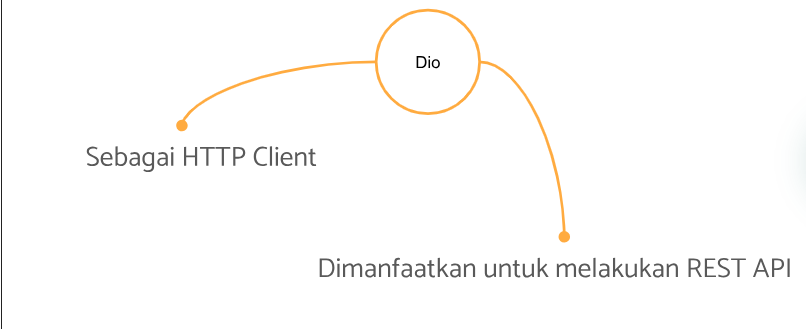
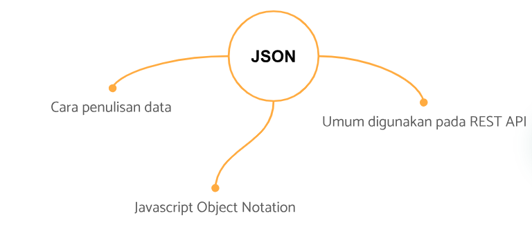
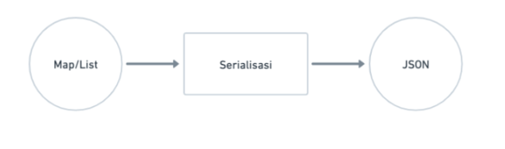
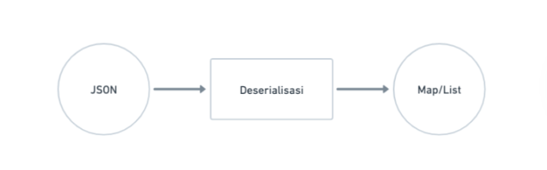

# REST API Client

### REST API

Representational Satet Transfer Application Programmming Interface

REST API adalh arsitektural yang memisahkan tampilan dengan proses bisnis, bbagian tampilan dengan proses bisnis berkirim data melalui HTTP Requst

### HTTP

HTTP adalah Protokol yang digunakan untuk berkirim data pada internet, biasanya data tersebut berbentuk media web.

- Pola Komunikasi

  - Client mengirim request
  - server mengolah dan membalas dengan memberi respons

- Stuktur Request

  - URL = Alamat halaman yang akan diakses
  - Method (GET, POST, PUT, DELETE) = Menunjukan Aksi yang diinginkan
  - Header = Informasi tambahan terkait request yang dikirimkan
  - Body = Data yang disertakan bersama request

- Struktur Response
  - Status Code : Kode yang mewakili keseluruhan response, baik sukses maupun gagal
  - Header : Informasi tambahan terkait response yang diberikan
  - Body : Data yang disertakan bersama response

### Dio

### Serialisasi JSON

- Mengubah stuktur data ke bentuk JSON
  

- Deserialisasi JSON
  
